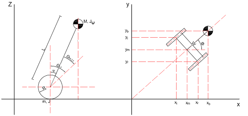

# the analys of LEGO invert pendulum
### 乐高倒立摆的简化坐标图如下所示：

Ψ：车体倾斜角度

R：车轮半径

Θl,r：左右车轮转过的角度

Θml,r：左右电机的转动角度

W：车轮间距

Φ：车体与x轴的夹角
### 各参数之间的相互关系

Θ = 1/2 * (Θl + Θr)

Φ = R/W * (Θr - Θl)

x'm = R * Θ' * cosΦ

y'm = R * Θ' * sinΦ

**各点在坐标系中的位置：**

xm: &int;x'mdt  
ym: &int;y'mdt  
zm: zm

xl: xm - W/2 * sinΦ  
yl: ym + W/2 * cosΦ  
zl: zm

xr: xm + W/2 * sinΦ  
yr: ym - W/2 * cosΦ  
zr: zm

xb: xm + L * sinΨ * cosΦ  
yb: ym + L * sinΨ * sinΦ  
zb: zm + L * sinΨ  

### 根据拉格朗日方程法对平衡车进行建模

**对速度进行分析**  

*车身的速度是由多个速度叠加得到的*  
<table>
	<tr>
		<td> </td> <td>车身倾斜引起</td> <td>车轮转动引起</td> <td>车身旋转引起</td>
	</tr>
	<tr>
		<td>x</td> <td>L*Ψ'*cosΨ*cosΦ</td> <td>(Θ'l+Θ'r)/2*R*cosΦ</td> 
		<td>-Φ'*L*sinΨ*sinΦ</td>
	</tr>
	<tr>
		<td>y</td> <td>L*Ψ'*cosΨ*sinΦ</td> <td>(Θ'l+Θ'r)/2*R*sinΦ</td>
		<td>Φ'*L*sinΨ*cosΦ</td>
	</tr>
	<tr>
		<td>z</td> <td>-L*Ψ'sinΨ</td> <td></td> <td></td>
	</tr>
</table>

*平衡车的总能量为车体的动能与两个车轮的动能之和*  
T=1/2*M*[(L*Ψ')2+(R*(Θ'l+Θ'r)/2)2+(R*L*(Θ'l-Θ'r)*sinΨ/W)2]  
		+1/2*JΨ*Ψ'2 -----------车体相对于电机轴转动的动能
		+1/2*JΨ((Θ'l-Θ'r)*R/W)2 -----------车体相对于Z轴的转动动能  
		+1/2*m*(Θ'l*R)2+1/2*m*(Θ'r*R)2 -----------车轮的平动动能  
		+1/2*Jw(Θ'l2+Θ'r2) -----------车轮相对于电机轴的转动动能  
		+m/4*((Θ'l-Θ'r)*R)2 ----------车轮相对于Z轴的转动动能  
  

